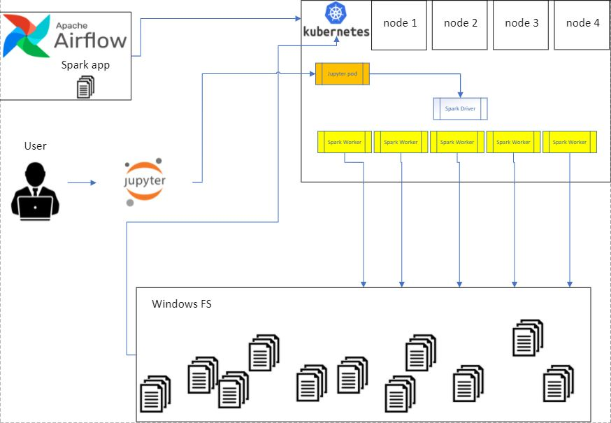

# Big Data - Spark project for Hamilton

The central question of this project and  POC is how we can improve the data processing part of the Harp application. 

The situation today is like this: 
- Application generates files (mostly parquet format) that lands in Windows FS storage. 
- There is an Airflow scheduled ETL job that fires Python code and SQL Server stored procedures against those files to calculate/aggregate and write calculated data in the SQL Server Database. 

The solution is slow and limited to scaling horizontally or vertically.

### POC requirements: 
Based on Big data tools like Spark, create a more optimized solution. 

# Spark 

Apache Spark™ is a multi-language engine (framework) for executing data engineering, data science, and machine learning on single-node machines or clusters.
Spark needs compute resources and resource managers like YARN (Hadoop), Mesos, or Kubernetes. 
Hamilton has Kubernetes infrastructure, and we can use it. 

After Spark 2.4 it has [Kubernetes API](https://spark.apache.org/docs/latest/running-on-kubernetes.html) and can comunicate directly with Kubernetes cluster.


# Use case - What we want

We want to have the ability to run Spark on Kubernetes based on scheduled intervals with Airflow as well as in interactive mode (for development, debugging, and data analysis and exploration process). The diagram below shows a schematic use case.



---
## The requirements for use case are:
- We must have the ability to run the [spark-submit](https://spark.apache.org/docs/latest/running-on-kubernetes.html#cluster-mode) jobs from Airflow with some time intervals.
- Users/Developers must have the ability to use [Jupyter Notebook to spin up Spark cluster on Kubernetes](https://towardsdatascience.com/jupyter-notebook-spark-on-kubernetes-880af7e06351) and run interactive queries against files located in WFS or SQL Server Database.


## Problems with this approach that needs to solve


1. Running spark-submit jobs remotely (from remote machine - different than Kubernetes nodes or podes) against Kubernetes cluster - it requires authentication, Kubernetes serviceAccount with the required role (cluster edit role) and other propertis which you can find [here](https://spark.apache.org/docs/latest/running-on-kubernetes.html#cluster-mode). 
If we succeed, we can run and test this [sample application without reading files from storage](./sample_spark_apps/sample_app_without_read.py) with this command

```bash
$SPARK_HOME/bin/spark-submit \
    --master k8s://<Kubernetes controller IP and port> \
    --conf spark.kubernetes.authenticate.driver.serviceAccountName=spark \
    --conf <authentication apoarametres>
    file:///<file path>/sample_app_without_read.py

```
---
**NOTE**

For spark worker and driver pods we are using 'itayb/spark:3.1.1-hadoop-3.2.0-aws' docker image from [this blog](https://towardsdatascience.com/jupyter-notebook-spark-on-kubernetes-880af7e06351). 

---

2. Deploying Jupyter Notebook in the Kubernetes cluster and use for interactive queries is a reasonable decision. [This blog](https://towardsdatascience.com/jupyter-notebook-spark-on-kubernetes-880af7e06351) explains minimum steps that we need. The YAML manifest for Jupyter you can find [here](./jupyter/).
- For successful deployment, we need Kubernetes Cluster manager to create StorageClass that we can use in StatefulSet;
- Ingress deployment and ingress rules with ingress controller or some external service to comunicate with Jupyter web Notebook without port forwarding;

3. One of the main problems is accessing data from the Spark workers in the Windows FS. There might be some solutions for this problem, but I think we can do three things to overcome this issue:
    - Mount Windows FS to the Kubernetes Cluster Nodes and, based on this, create [StorageClass](https://kubernetes.io/docs/concepts/storage/storage-classes) that we can then use with [Spark Kubernetes Volumes](https://spark.apache.org/docs/latest/running-on-kubernetes.html#:~:text=Using-,Kubernetes%20Volumes,-Users%20can%20mount) and persistentVolumeClaim in the spark-submit scenario or with Jupyter Notebook. The mount point will refer to directories where data is located and Spark application could read parquet and csv files. 

    - Create FTP or SFTP Server and access data via API calls; 

    - Configure more advanced storage (Hadoop, GlusterFS, Cinder, or MinIO, that are open-source and free to use) on-premise;

---
## Useful links

- [Running Spark on Kubernetes - Official](https://spark.apache.org/docs/latest/running-on-kubernetes.html#running-spark-on-kubernetes)
- [Apache Spark with Kubernetes and Fast S3 Access](https://towardsdatascience.com/apache-spark-with-kubernetes-and-fast-s3-access-27e64eb14e0f)
- [Running Spark on Kubernetes: Approaches and Workflow](https://towardsdatascience.com/running-spark-on-kubernetes-approaches-and-workflow-75f0485a4333)
- [Jupyter Notebook & Spark on Kubernetes](https://towardsdatascience.com/jupyter-notebook-spark-on-kubernetes-880af7e06351)
- [Setting up, Managing & Monitoring Spark on Kubernetes](https://www.datamechanics.co/blog-post/setting-up-managing-monitoring-spark-on-kubernetes)
- [Optimized Spark Docker Images](https://www.datamechanics.co/blog-post/optimized-spark-docker-images-now-available)
